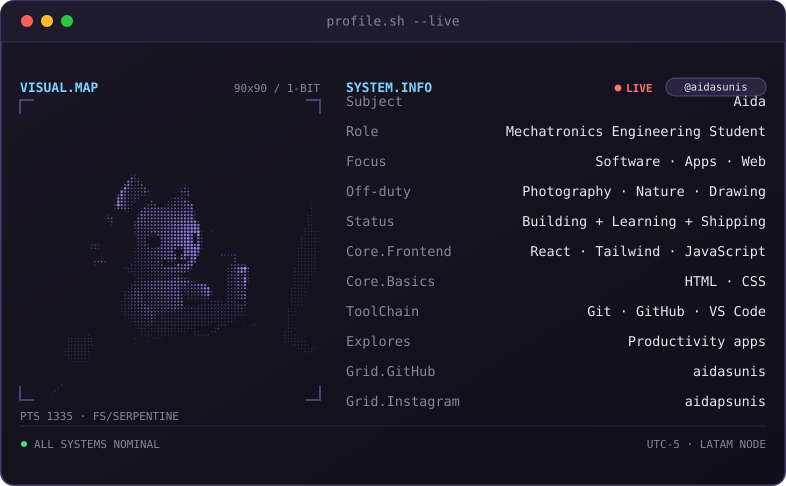

 

 

---

## About me

I study Mechatronics Engineering, but I spend a good chunk of my free time building web pages
and apps — something I picked up on my own and enjoy more than I probably should admit.

Right now I'm working on a couple of apps, with the idea of eventually shipping one to the Play
Store. I'm also a big fan of trying out new apps — especially productivity ones, always looking
for the one that finally gets my life organized.

 

## Stack

---

built by hand, no templates

